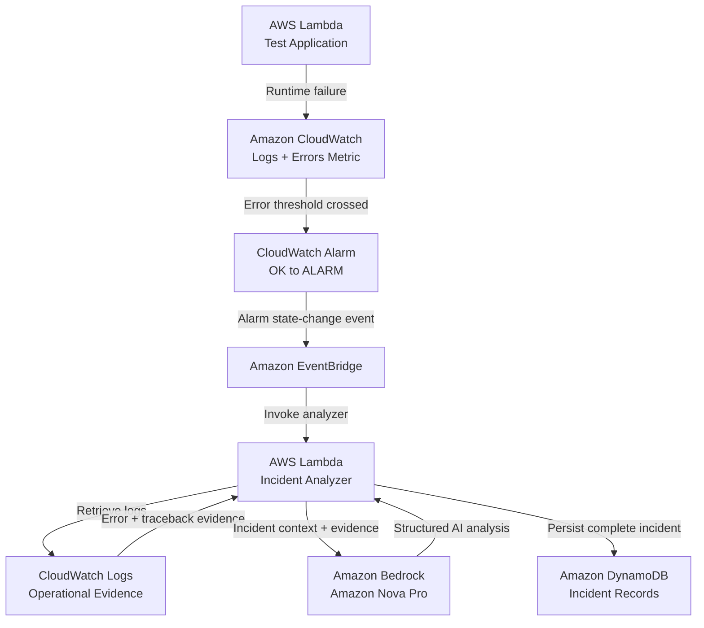

# AI Incident Intelligence

> An event-driven AI incident-response system on AWS that detects Lambda failures, retrieves operational evidence, uses Amazon Bedrock to generate structured root-cause analysis and remediation guidance, and persists the complete incident record in DynamoDB — all provisioned with Terraform and least-privilege IAM.

## Overview

AI Incident Intelligence is a cloud engineering and AI operations project that demonstrates how generative AI can be integrated into a real incident-response workflow.

Instead of sending arbitrary prompts to an AI model, this system starts with an actual infrastructure event.

The completed workflow:

1. An AWS Lambda test application experiences a controlled failure.
2. Amazon CloudWatch detects the Lambda error.
3. The CloudWatch alarm transitions from `OK` to `ALARM`.
4. Amazon EventBridge routes the state-change event.
5. An Incident Analyzer Lambda receives the incident.
6. The analyzer retrieves relevant CloudWatch error and traceback evidence.
7. Amazon Bedrock analyzes the operational evidence.
8. Bedrock produces structured root-cause analysis and remediation guidance.
9. The complete incident record is persisted in Amazon DynamoDB.

The AWS environment is provisioned with Terraform and secured using least-privilege IAM.

## Why I Built This

Cloud and AI engineering increasingly requires more than deploying infrastructure or calling an AI API.

I wanted this project to demonstrate the operational side of AI engineering: monitoring systems, collecting evidence, automating response workflows, securing service-to-service access, handling AI failures safely, and maintaining persistent incident history.

The project combines:

- AWS cloud infrastructure
- Infrastructure as Code
- observability
- event-driven architecture
- Python serverless development
- generative AI
- IAM security
- incident-response engineering
---

## Architecture

The system is designed as an event-driven pipeline where each AWS service has a specific operational responsibility.



## AWS Component Responsibilities

### Test Application Lambda

A dedicated AWS Lambda function generates controlled failures for repeatable incident-response testing.

The function supports both a healthy execution path and an intentional failure path, allowing the full incident pipeline to be validated safely.

### Amazon CloudWatch

Amazon CloudWatch provides the observability layer by capturing Lambda execution logs, runtime exceptions, traceback evidence, Lambda Errors metrics, and alarm state changes.

A metric alarm monitors the test application's `Errors` metric and transitions from `OK` to `ALARM` when the configured threshold is crossed.

### Amazon EventBridge

Amazon EventBridge provides event-driven routing.

Rather than polling for failures, EventBridge reacts to the CloudWatch alarm state-change event and automatically invokes the Incident Analyzer.

### Incident Analyzer Lambda

The Incident Analyzer is the orchestration layer.

It:

- receives the CloudWatch alarm event
- builds a structured incident record
- retrieves relevant CloudWatch log evidence
- sends the evidence to Amazon Bedrock
- validates the AI response
- records analysis status
- persists the completed incident in DynamoDB

### Amazon Bedrock

Amazon Bedrock provides the AI reasoning layer using Amazon Nova Pro.

The model receives structured incident metadata together with real operational evidence and returns:

- incident summary
- severity
- likely root cause
- supporting evidence
- recommended actions
- confidence

The model is instructed to analyze only the supplied evidence and avoid inventing facts.

### Amazon DynamoDB

Amazon DynamoDB provides persistent incident storage.

Each record contains both the original infrastructure event and the AI-generated analysis, creating a durable incident history that can be queried after the event.
---

## Reliability Design

The incident workflow is designed so that AI enhances the response process without becoming a single point of failure.

If Amazon Bedrock succeeds, the analyzer stores:

`analysis_status = SUCCESS`

along with the structured AI analysis.

If the Bedrock request, model response, or JSON parsing fails, the original incident is still preserved in DynamoDB with:

`analysis_status = FAILED`

and the associated error message.

This ensures that failure of the AI layer does not cause loss of the underlying operational incident.

The Incident Analyzer Lambda timeout was also increased from 10 seconds to 30 seconds after Bedrock inference and CloudWatch log retrieval were added to the execution path.

That change was made to provide adequate execution time for external service calls while keeping the function bounded.

## Security and Least-Privilege IAM

IAM permissions are scoped to the specific actions and resources required by the system.

The Incident Analyzer receives permission to write incident records using:

`dynamodb:PutItem`

This permission is scoped to the `ai-incident-records` DynamoDB table.

The analyzer retrieves operational evidence using:

`logs:FilterLogEvents`

This permission is scoped to the test application's CloudWatch log group.

The analyzer invokes the configured Bedrock model using:

`bedrock:InvokeModel`

This permission is scoped to the Amazon Nova Pro foundation model used by the project.

The architecture avoids broad permissions such as `logs:*`, `dynamodb:*`, or `bedrock:*`.

## Terraform Deployment Discipline

Infrastructure changes were deployed using a controlled Terraform workflow.

```text
terraform fmt
      ↓
terraform validate
      ↓
terraform plan
      ↓
review proposed changes
      ↓
save exact plan
      ↓
terraform apply <saved-plan>
      ↓
terraform plan
      ↓
verify zero drift
```

```

Before infrastructure changes were applied, each Terraform plan was reviewed for:

- resources being created
- resources being modified
- resources being destroyed
- IAM permission scope
- replacement risk
- expected blast radius

The final AI integration deployment showed:

```text
1 added
1 changed
0 destroyed
```

After deployment and end-to-end testing, the final Terraform plan returned:

```text
No changes. Your infrastructure matches the configuration.
```

This confirmed that the deployed AWS environment matched the intended Infrastructure as Code state.

## Engineering Decisions

### Evidence Before AI

The system does not ask Amazon Bedrock to diagnose an incident from only an alarm name.

The Incident Analyzer first retrieves real CloudWatch error and traceback evidence and supplies that operational evidence to the model.

This grounds the AI response in observable system behavior.

### Event-Driven Instead of Polling

Amazon EventBridge reacts to CloudWatch alarm state changes.

This removes the need for a continuously running polling process and creates a loosely coupled event-driven architecture.

### Controlled Failure Testing

A dedicated test Lambda supports intentional failures.

This provides a repeatable and safe method for validating the full incident-response pipeline.

### Persistent Incident History

AI analysis is persisted in DynamoDB together with the original incident metadata.

The analysis therefore becomes part of the operational record instead of existing only as temporary Lambda output.

### AI Failure Isolation

The original incident is preserved even when the AI layer fails.

This prevents Amazon Bedrock from becoming a single point of failure for incident recording.

### Deployment Blast-Radius Review

Terraform plans were reviewed before deployment rather than immediately applying infrastructure changes.

This provided visibility into resource creation, in-place modification, destruction risk, and IAM changes before AWS infrastructure was altered.

---

## End-to-End Validation

The completed system was tested through a controlled Lambda failure to validate the entire incident-response path.

```text
Controlled Lambda Failure
        ↓
CloudWatch Error Metric
        ↓
Alarm: OK → ALARM
        ↓
EventBridge State-Change Event
        ↓
Incident Analyzer Lambda
        ↓
CloudWatch Log Evidence Retrieved
        ↓
Amazon Bedrock Analysis
        ↓
Structured Incident Intelligence
        ↓
DynamoDB Persistence
        ↓
Successful Record Read-Back
```

The final Incident Analyzer execution confirmed all major stages:

```text
INCIDENT_EVENT
LOG_EVIDENCE
BEDROCK_ANALYSIS
INCIDENT_STORED
```

### Final AI Analysis Result

During the controlled test, Amazon Bedrock correctly identified the supplied failure evidence.

```text
Severity: LOW

Likely Root Cause:
Simulated application failure for incident-response testing.

Confidence:
HIGH
```

The analysis also included supporting CloudWatch evidence and recommended actions.

Because the test failure was intentionally generated, the model appropriately recognized that no emergency remediation was required unless the failure was unexpected.

## DynamoDB Persistence Verification

The completed incident was successfully read back from the `ai-incident-records` DynamoDB table.

The persisted record contained:

- incident ID
- alarm name
- timestamp
- AWS region
- current alarm state
- previous alarm state
- threshold-crossing reason
- source
- AI analysis status
- incident summary
- severity
- likely root cause
- supporting evidence
- recommended actions
- confidence

The final record confirmed:

```text
analysis_status = SUCCESS
severity        = LOW
confidence      = HIGH
```

This verified that the AI analysis was not only generated in Lambda logs but persisted as part of the permanent incident record.

## Final Infrastructure Verification

After the end-to-end test, Terraform was run again to compare the deployed AWS infrastructure against the project configuration.

The result was:

```text
No changes. Your infrastructure matches the configuration.
```

This provided final confirmation that the environment had reached the intended Infrastructure as Code state with no outstanding drift.

## Technology Stack

| Area | Technology |
|---|---|
| Cloud Platform | AWS |
| Infrastructure as Code | Terraform |
| Programming Language | Python |
| Serverless Compute | AWS Lambda |
| Observability | Amazon CloudWatch |
| Event Routing | Amazon EventBridge |
| Generative AI | Amazon Bedrock |
| Foundation Model | Amazon Nova Pro |
| Database | Amazon DynamoDB |
| Identity and Access | AWS IAM |
| Version Control | Git / GitHub |

## Skills Demonstrated

This project demonstrates experience across both cloud infrastructure and AI operations, including:

- AWS serverless architecture
- Terraform Infrastructure as Code
- event-driven system design
- CloudWatch monitoring and alerting
- EventBridge automation
- Python Lambda development
- Amazon Bedrock integration
- evidence-grounded AI prompting
- structured AI output handling
- root-cause analysis workflows
- DynamoDB persistence
- least-privilege IAM
- failure isolation
- deployment blast-radius review
- controlled incident testing
- troubleshooting and validation
- infrastructure drift verification

## Repository Structure

```text
ai-incident-intelligence/
│
├── lambda/
│   ├── test_application/
│   │   └── lambda_function.py
│   │
│   └── incident_analyzer/
│       └── lambda_function.py
│
├── terraform/
│   ├── versions.tf
│   ├── test_application.tf
│   ├── cloudwatch_alarm.tf
│   ├── incident_analyzer.tf
│   ├── incident_ai_access.tf
│   ├── eventbridge.tf
│   └── dynamodb.tf
│
├── docs/
├── evidence/
├── tests/
├── .gitignore
└── README.md
```

## Key Takeaway

This project was intentionally designed to go beyond simply calling a generative AI model.

The surrounding system provides the operational controls required to make AI useful in a cloud engineering workflow:

```text
Detection
Observability
Event Routing
Evidence Collection
AI Analysis
Failure Handling
Security
Persistence
Testing
Infrastructure Automation
```

The result is an event-driven AI incident-response system on AWS that detects Lambda failures, retrieves operational evidence, uses Amazon Bedrock to generate structured root-cause analysis and remediation guidance, and persists the complete incident record in DynamoDB — all provisioned with Terraform and least-privilege IAM.

## Author

**Jamil Lyons**

Cloud Engineering | AWS | Terraform | DevOps | AI Infrastructure
