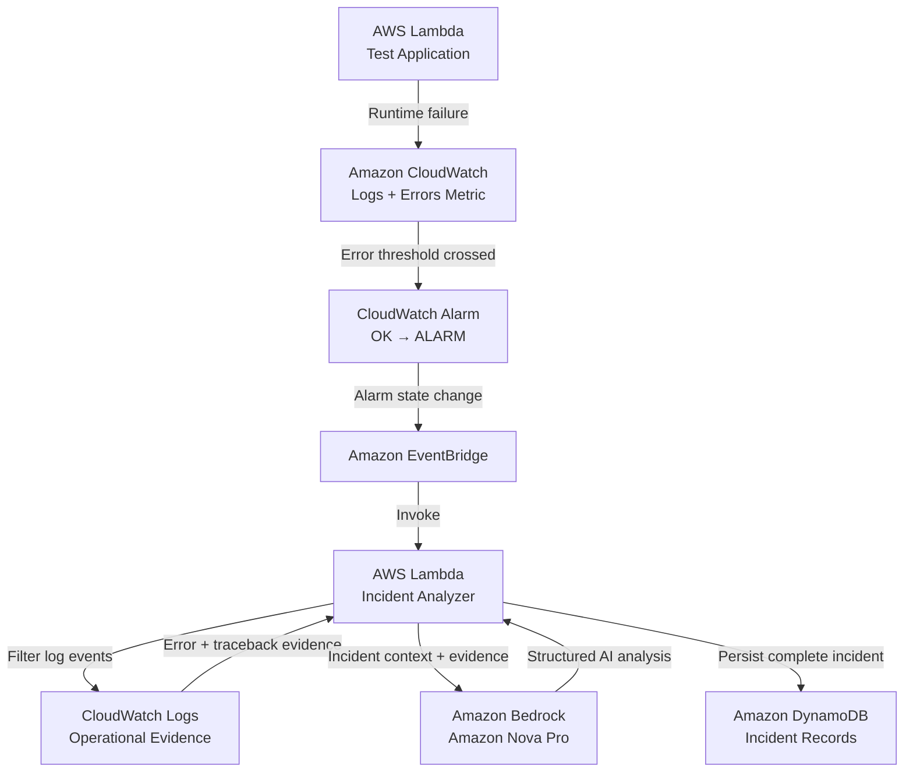

# AI Incident Intelligence — Architecture

## Purpose

AI Incident Intelligence is an event-driven incident-response system built on AWS.

The system detects application failures, collects operational evidence, routes incidents automatically, performs evidence-grounded AI analysis with Amazon Bedrock, and persists the complete incident record in DynamoDB.

The infrastructure is provisioned with Terraform and secured using least-privilege IAM.

---

## Architecture Goals

The architecture was designed around several engineering goals:

- event-driven failure detection
- minimal manual intervention
- evidence-based incident analysis
- loosely coupled AWS services
- persistent incident history
- least-privilege service access
- repeatable infrastructure deployment
- controlled failure testing
- graceful AI failure handling
- observable end-to-end execution

---

## High-Level Architecture



---

## Request and Event Flow

### 1. Application Execution

The test application Lambda supports two execution paths.

**Healthy execution**

```json
{
  "simulate_failure": false
}
```

The function returns normally.

**Controlled failure**

```json
{
  "simulate_failure": true
}
```

The function intentionally raises a `RuntimeError`.

This gives the project a deterministic and repeatable method for validating the incident-response pipeline without waiting for an unpredictable production failure.

### 2. CloudWatch Observability

AWS Lambda publishes operational telemetry to Amazon CloudWatch.

CloudWatch captures:

- execution logs
- runtime exceptions
- traceback evidence
- invocation metrics
- Lambda Errors metrics

A CloudWatch metric alarm monitors the test application's `Errors` metric.

The failure threshold is:

```text
Errors >= 1
```

When the threshold is crossed, the alarm transitions:

```text
OK → ALARM
```

### 3. EventBridge Routing

Amazon EventBridge listens for CloudWatch alarm state-change events.

The routing rule filters for:

- source: `aws.cloudwatch`
- CloudWatch Alarm State Change
- the test application alarm
- state: `ALARM`

When those conditions match, EventBridge automatically invokes the Incident Analyzer Lambda.

This keeps the architecture event-driven and eliminates the need for continuous polling.

---

## Operational Evidence Collection

The Incident Analyzer does not send only an alarm name to the AI model.

It first retrieves relevant CloudWatch logs surrounding the incident and searches for operational evidence such as:

```text
ERROR
RuntimeError
Exception
Traceback
```

The architecture therefore follows:

```text
Observed Infrastructure Evidence
            ↓
       AI Analysis
```

This grounds the model response in actual system behavior rather than asking the model to speculate about the cause of the incident.

---

## AI Analysis Layer

Amazon Bedrock provides the generative AI reasoning layer using Amazon Nova Pro.

The Incident Analyzer supplies:

- alarm metadata
- state-change information
- timestamp
- AWS region
- CloudWatch error evidence
- traceback information

The model returns structured incident intelligence containing:

```text
incident_summary
severity
likely_root_cause
evidence
recommended_actions
confidence
```

The prompt explicitly instructs the model to use only the supplied evidence and avoid inventing unsupported facts.
---

## AI Failure Isolation

Amazon Bedrock is treated as an enhancement to the incident-response workflow, not as a dependency required to preserve the incident itself.

If AI processing succeeds:

```text
analysis_status = SUCCESS
```

and the structured Bedrock analysis is attached to the incident.

If Bedrock inference, response parsing, or another AI-related step fails:

```text
analysis_status = FAILED
```

the failure reason is recorded, but the underlying incident is still persisted.

This prevents the AI layer from becoming a single point of failure.

---

## Persistence Layer

Amazon DynamoDB stores the completed incident record.

Table:

```text
ai-incident-records
```

Primary key:

```text
incident_id
```

The stored item contains both operational metadata and AI-generated intelligence.

### Operational Metadata

```text
incident_id
alarm_name
current_state
previous_state
timestamp
region
source
reason
```

### AI Analysis

```text
analysis_status
incident_summary
severity
likely_root_cause
evidence
recommended_actions
confidence
```

This provides durable incident history for later review, troubleshooting, reporting, or future automation.

---

## IAM Architecture

The project follows least-privilege IAM principles.

### DynamoDB Access

Required action:

```text
dynamodb:PutItem
```

Scoped only to:

```text
ai-incident-records
```

### CloudWatch Logs Access

Required action:

```text
logs:FilterLogEvents
```

Scoped only to the test application's CloudWatch log group.

### Amazon Bedrock Access

Required action:

```text
bedrock:InvokeModel
```

Scoped to the Amazon Nova Pro foundation model used by the project.

Broad permissions such as:

```text
dynamodb:*
logs:*
bedrock:*
```

are intentionally avoided.

---

## Infrastructure as Code

Terraform manages the AWS infrastructure for the project.

Major resources include:

- AWS Lambda functions
- Lambda execution roles
- IAM policies
- CloudWatch log groups
- CloudWatch metric alarm
- EventBridge rule
- EventBridge target
- Lambda invocation permission
- DynamoDB table
- Lambda environment variables

The deployment workflow follows:

```text
terraform fmt
      ↓
terraform validate
      ↓
terraform plan
      ↓
review blast radius
      ↓
save exact plan
      ↓
terraform apply <saved-plan>
      ↓
terraform plan
      ↓
verify zero drift
```

Terraform plans were reviewed before deployment to identify:

- resource creation
- in-place modification
- destruction
- replacement risk
- IAM scope
- expected blast radius

The final AI integration deployment showed:

```text
1 added
1 changed
0 destroyed
```

---

## Reliability Considerations

### Lambda Timeout

The Incident Analyzer originally used a 10-second timeout.

After CloudWatch evidence retrieval and Amazon Bedrock inference were added to the execution path, the timeout was increased to:

```text
30 seconds
```

This provides additional headroom for AWS service calls while keeping execution bounded.

### Incident Preservation

Incident storage does not depend on successful AI inference.

### Evidence Grounding

AI analysis is based on retrieved CloudWatch evidence rather than only alarm metadata.

### Event-Driven Execution

EventBridge eliminates the need for continuous polling.

### Controlled Testing

The dedicated test Lambda provides a deterministic method for validating failure handling end to end.

---

## Final Validated Flow

The completed architecture was validated through a controlled incident:

```text
Controlled Lambda Failure
        ↓
CloudWatch Error Detection
        ↓
Alarm OK → ALARM
        ↓
EventBridge Routing
        ↓
Incident Analyzer Invocation
        ↓
CloudWatch Evidence Retrieval
        ↓
Amazon Bedrock Analysis
        ↓
Structured Root-Cause Intelligence
        ↓
DynamoDB Persistence
        ↓
Successful Record Read-Back
```

Observed execution markers included:

```text
INCIDENT_EVENT
LOG_EVIDENCE
BEDROCK_ANALYSIS
INCIDENT_STORED
```

The final persisted incident confirmed:

```text
analysis_status = SUCCESS
severity        = LOW
confidence      = HIGH
```

The final Terraform verification returned:

```text
No changes. Your infrastructure matches the configuration.
```

---

## Core Engineering Principle

The AI model is only one component of the system.

The surrounding architecture provides the operational controls required to make AI useful in a cloud engineering workflow:

```text
Detection
Observability
Event Routing
Evidence Collection
AI Analysis
Failure Handling
Security
Persistence
Testing
Infrastructure as Code
```

The result is an event-driven AI incident-response system rather than simply an AI API integration.
